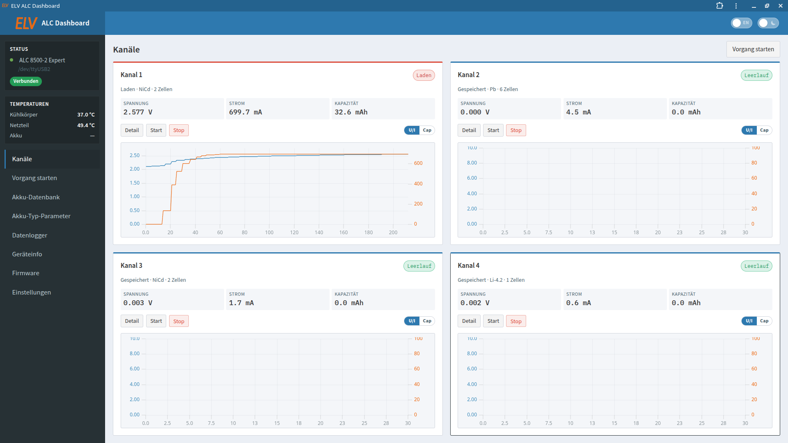

# ELV ALC Dashboard

> **AI-assisted advanced implementation** of a modern web UI for **ELV / Voltcraft ALC** chargers — a Linux successor to the Windows **ChargeProfessional** software.

Logger data and battery presets are stored as files — **no SQL database**.



---

## Supported devices & protocol status

Ordered by model number (oldest → newest):

| Device | Status | Protocol notes |
|--------|--------|----------------|
| **ALC 1800 PC** | Unsupported | PC datalogger option only; data protocol not publicly documented. |
| **ALC 3000 PC** | Active (simulator; hardware **untested**) | USB/STX per [ChargeEasy Teil 2 (PDF)](https://media.elv.com/file/76962_alc3000pc_teil2.pdf); 1 channel (`alc3000`). |
| **ALC 5000 Mobile** | Active (simulator; hardware **untested**) | Same [ChargeEasy Teil 2 (PDF)](https://media.elv.com/file/76962_alc3000pc_teil2.pdf); Ident **`j`** (FW &gt; 2.00) only; 2 channels (`alc5000`). |
| **ALC 7000 Expert** | Active (simulator; hardware **untested**) | RS-232 wire protocol **adapted from** the historical PC software lineage [alc7t](https://www.franksteinberg.de/fstAlt/alc7t.html) / [pyALC7T](https://github.com/bug400/pyalc7t) (GPLv2). Separate reimplementation — see [docs/protocol.md](docs/protocol.md). |
| **ALC 8000 Plus** | Active (simulator; hardware **untested**) | USB/STX per [ELVjournal protocol PDF](https://media.elv.com/file/59066_alc8000_alc8500_expert_teil7.pdf); 3 channels, **no** on-device logger (`alc8xxx`). |
| **ALC 8500 Expert** | Active (simulator; hardware **untested**) | Same [ELVjournal protocol PDF](https://media.elv.com/file/59066_alc8000_alc8500_expert_teil7.pdf) as 8000 Plus — **not** the 8500-2 command set (`alc8xxx`). |
| **ALC 8500-2 Expert** | Active | **Reimplementation** of the USB/serial protocol in [ELV manual chapter 18 (PDF)](https://media.elv.com/file/59066_69326_alc8500e_2_um.pdf). |
| **ALC 9000** | Unsupported | PC datalogger option only; data protocol not publicly documented. |

### Firmware requirement

**Use the newest firmware available for your model.**

If ELV released **ChargeProfessional 2.x** for your charger, install the matching **2.x firmware** from ELV’s downloads before using this dashboard. Older **1.x** firmware is then unsupported.

**ChargeProfessional 1.x firmware support** applies only when ELV never published a 2.x generation for that model.

**ALC 3000 / 5000 Mobile / 7000 / 8000 Plus / 8500 Expert have not been tested against real hardware.** If you can help verify serial behaviour, please open an issue.

More detail: [docs/devices.md](docs/devices.md) · [docs/protocol.md](docs/protocol.md).

### Device user manuals (Bedienungsanleitungen)

Official-style user manuals via Manualslib (not protocol articles):

| Device | Manual |
|--------|--------|
| **ALC 1800 PC** | [Manualslib](https://www.manualslib.de/manual/238171/Elv-Alc1800Pc.html) |
| **ALC 3000 PC** | [Manualslib](https://www.manualslib.de/manual/182482/Elv-Akku-Lade-Center-Alc-3000-Pc.html) |
| **ALC 5000** | [Manualslib](https://www.manualslib.de/manual/86513/Elv-Alc-5000.html) |
| **ALC 7000 Expert** | [Manualslib](https://www.manualslib.de/manual/20902/Elv-Alc-7000-Expert.html) |
| **ALC 8000** | [Manualslib](https://www.manualslib.de/manual/90908/Elv-Alc-8000.html) |
| **ALC 8500 Expert** | [Manualslib](https://www.manualslib.de/manual/321977/Elv-Alc-8500-Expert.html) |
| **ALC 9000** | [ELV PDF](https://media.elv.com/file/2003_06_15_alc9000.pdf) |

Protocol / wire sources remain in the table above and in [docs/protocol.md](docs/protocol.md).

---

## Features

| Area | Function |
|------|----------|
| Connection | Device profile, free-text serial port (`/dev/ttyUSB*`, `/dev/ttyS*`, …), auto-detect, **per-model simulator** |
| Channels | Live overview (WebSocket) for `channel_count` channels: **U/I** or **capacity** chart, status badges, start/stop |
| Channel detail | Stacked charts — U/I (blue/orange) and capacity (green) — sized for 1080p, scales to 2K/4K |
| Start process | All programs, parameter dialog, safety confirm when the device corrects values |
| Battery database | 40 local presets, **Import from ALC** / **Export to ALC**, JSON backup |
| Chemistry parameters | Read / apply / restore defaults (`g`/`G`, `h`/`H`, `j`/`J`) |
| Data logger | Readout, U/I + capacity charts, archive as JSON/CSV/**PDF** under `data/logger/` |
| PDF export | Landscape report: page 1 U/I, page 2 capacity, page 3 data table |
| Device | Info, settings, guided firmware **instructions** (no in-app flash; not for 7000) |
| UI | Light/dark theme (AdminLTE-inspired), DE/EN language switch, sidebar status & temperatures, fluid scale for 1080p–4K, installable as Chrome PWA |

**Not available over USB:** Internal resistance (Ri) measurement — device only, with four-wire cable.

Further docs: [devices](docs/devices.md) · [feature matrix](docs/feature-matrix.md) · [protocol](docs/protocol.md)  
User manuals: see [Device user manuals](#device-user-manuals-bedienungsanleitungen) above.  
Protocol PDFs: [8500-2 chapter 18](https://media.elv.com/file/59066_69326_alc8500e_2_um.pdf) · [8000/8500 Expert ELVjournal](https://media.elv.com/file/59066_alc8000_alc8500_expert_teil7.pdf) · [3000 PC ChargeEasy Teil 2](https://media.elv.com/file/76962_alc3000pc_teil2.pdf)

---

## Stack

- **Backend:** Python 3.11+, FastAPI, pyserial, reportlab
- **Frontend:** Vite, React, TypeScript, uPlot
- **Data:** files under `data/` (no SQL)
- **Run options:** local venv, Docker Compose, or systemd under `/opt/alc`

---

## AI install prompts

Paste one of these into **Cursor**, **OpenCode**, or a similar agent. The agent **always** refreshes `main` from GitHub and runs a full install/reinstall (rebuild + restart) — even if an older install already exists.

### Systemd (`/opt/alc`)

Autostart on boot via `elv-alc-dashboard.service`.

→ Copy from [installer/ai-install-prompt.md](installer/ai-install-prompt.md)

### Docker Compose

Build and run the container from the repo (`docker compose up`).

→ Copy from [installer/ai-install-prompt-docker.md](installer/ai-install-prompt-docker.md)

---

## Manual install

### Requirements

| Path | Needs |
|------|--------|
| Local / systemd | Python 3.11+, Node.js 20+, `dialout` for real hardware |
| Docker | Docker Engine + Compose plugin (Linux host for USB/serial) |

```bash
sudo usermod -aG dialout $USER   # real hardware; log out and back in afterwards
```

### Local (venv + `run.sh`)

```bash
git clone https://github.com/oe3gwu/ELV-ALC-Dashboard.git
cd ELV-ALC-Dashboard

python3 -m venv .venv
source .venv/bin/activate
pip install -r backend/requirements.txt

cd frontend && npm install && npm run build && cd ..
./scripts/run.sh
```

Open [http://127.0.0.1:8080](http://127.0.0.1:8080).

Default [`config.yaml`](config.yaml): ALC 8500-2 + **simulator**. Without hardware keep `serial_port` empty and `simulator: true`.

### Docker Compose

```bash
git clone https://github.com/oe3gwu/ELV-ALC-Dashboard.git
cd ELV-ALC-Dashboard
docker compose up --build
```

Open [http://127.0.0.1:8080](http://127.0.0.1:8080).  
`config.yaml` and `data/` are mounted from the host.

| Command | Effect |
|---------|--------|
| `docker compose up --build` | Build and start (foreground) |
| `docker compose up -d --build` | Detached |
| `docker compose logs -f` | Follow logs |
| `docker compose down` | Stop |

Image name: `elv-alc-dashboard:local` (built locally; no registry required).

### systemd (`/opt/alc`, autostart)

Requires Python 3.11+, Node.js/npm 20+, `rsync`, root.

```bash
cd ELV-ALC-Dashboard
sudo ./scripts/install-systemd.sh
```

The script creates user `alc` (`dialout`), installs to `/opt/alc`, builds the frontend, installs udev + unit + polkit (UI **Herunterfahren**), then enables and restarts the service. Existing installs that still use `elv-alc` are migrated to `alc` and the old user is removed. UI: `http://<IP>:8080` (listens on `0.0.0.0:8080`).

```bash
sudo systemctl status elv-alc-dashboard
journalctl -u elv-alc-dashboard -f
sudo systemctl restart elv-alc-dashboard
```

Update (keeps `data/`):

```bash
git pull
sudo ./scripts/install-systemd.sh
```

Uninstall:

```bash
sudo ./scripts/uninstall-systemd.sh           # service only
sudo ./scripts/uninstall-systemd.sh --purge   # also /opt/alc + user
```

Unit: [`systemd/elv-alc-dashboard.service`](systemd/elv-alc-dashboard.service) · custom path: `sudo DEST=/opt/my-alc ./scripts/install-systemd.sh`

### Real hardware (all install paths)

1. Connect the ALC (USB or RS-232).
2. Optional stable names — [`udev/99-elv-alc.rules`](udev/99-elv-alc.rules):

```bash
sudo cp udev/99-elv-alc.rules /etc/udev/rules.d/
sudo udevadm control --reload-rules && sudo udevadm trigger
```

3. In Settings / `config.yaml`: `simulator: false`, `serial_port` e.g. `/dev/elv-alc` or `/dev/ttyUSB0` (empty = auto-detect).
4. **Docker only:** uncomment `devices:` + `group_add: [dialout]` in [`docker-compose.yml`](docker-compose.yml) and match the device path.
5. Restart the app / compose / systemd service.
6. For 8500-2, use **Battery database → Import from ALC** if needed.

Serial defaults: **8500-2 → 38400 8E1**; **7000 → 9600 8E1**. ALC 7000 is RS-232 (no ELV USB ID) — use the adapter node.

---

## Configuration

[`config.yaml`](config.yaml):

| Key | Meaning |
|-----|---------|
| `host` / `port` | HTTP bind (default `127.0.0.1:8080`; Docker/systemd listen on `0.0.0.0`) |
| `device_model` | Profile id, e.g. `alc8500_2_expert` or `alc7000_expert` |
| `serial_port` | Free text, e.g. `/dev/ttyUSB0`, `/dev/ttyS0`; empty = auto-detect |
| `baudrate` | Default `38400` (8500-2); 7000 uses profile baudrate 9600 |
| `simulator` | `true` = per-model simulator (only when `serial_port` is empty) |
| `poll_interval` | Live polling interval in seconds |
| `data_dir` | Archive directory (relative to project root) |
| `usb_hints` | Vendor/product IDs for auto-detect |

---

## Battery database (presets)

| Action | Effect |
|--------|--------|
| Edit / save | local only (`data/battery-db.json`) |
| **Import from ALC** | device → local file (`d`) |
| **Export to ALC** | local file → device (`D`), overwrites device DB |
| Save / load JSON | backup between PCs |

---

## Chrome PWA

After the UI is running: Chrome ⋮ → **Cast, save, and share** → **Install page as app** (wording varies). Needs **HTTPS** or **localhost**. The PWA caches the UI shell only — live API/WebSocket still need the server.

---

## Development

```bash
# Terminal 1 — API
source .venv/bin/activate
cd backend && PYTHONPATH=. uvicorn app.main:app --host 127.0.0.1 --port 8080 --reload

# Terminal 2 — frontend hot reload
cd frontend && npm run dev
```

Vite proxies `/api` and `/ws` to port 8080 (`frontend/vite.config.ts`).  
After UI changes for production: `cd frontend && npm run build` (or delete `frontend/dist` and use `./scripts/run.sh`).

---

## Project layout

```
ELV-ALC-Dashboard/
├── backend/app/          # FastAPI, devices/, protocol, serial, simulators, services
├── frontend/             # React UI (Vite)
├── data/                 # logger archive, battery-db.json
├── docs/                 # protocol, feature matrix, screenshots
├── installer/            # AI install prompts (systemd + Docker)
├── scripts/              # run.sh, install-systemd.sh, uninstall-systemd.sh
├── systemd/              # elv-alc-dashboard.service
├── polkit/               # allow service user `alc` to power off the host
├── udev/                 # 99-elv-alc.rules
├── Dockerfile
├── docker-compose.yml
└── config.yaml
```

---

## License

Copyright (C) 2026 **Rainer Weninger**

**Source-available** under **Apache License 2.0** + **[Commons Clause](https://commonsclause.com/)** — see [LICENSE](LICENSE). Allowed on GitHub; **not** OSI “Open Source”.

- **Allowed:** use, study, modify; run privately or in a company; share source with the same notices.
- **Not allowed** without a separate commercial license: selling this software (or a service whose value is substantially this software).
- Bundling into a much larger product with substantial independent value is a grey area under the Commons Clause FAQ — contact the copyright holder for explicit rights.
- No rights to ELV / Voltcraft trademarks or proprietary firmware.

---

## Disclaimer

Unofficial source-available control based on the publicly documented interface protocol.  
**Use at your own risk.** Wrong parameters can damage batteries. Firmware updates only with **official ELV files** and the ELV update tool — this dashboard never flashes.

ELV, Voltcraft, and ChargeProfessional are trademarks of their respective owners; this project is not affiliated with ELV/Voltcraft.
